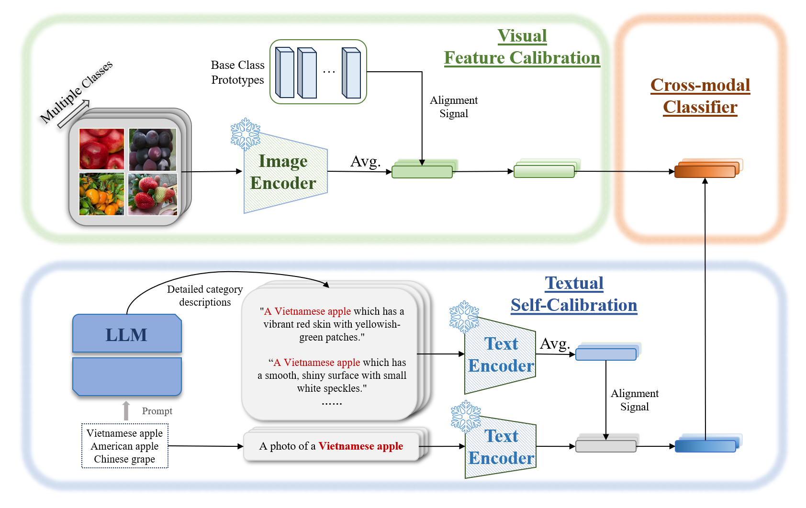

# TF-MCA: Training-Free Modality Calibration and Alignment


***A novel bi-level modality calibration-based framework for few-shot counterfeit fruit detection***

This repository contains the official implementation of our paper: *"A novel bi-level modality calibration-based framework for few-shot counterfeit fruit detection"* by Dat Tran-Anh and Thieu Huy Nguyen from Thuyloi University.

## Overview

TF-MCA (Training-Free Modality Calibration and Alignment) is a completely training-free framework designed to enhance Few-Shot Class-Incremental Learning (FSCIL) performance in fine-grained domains, particularly for counterfeit agricultural product detection. The framework addresses three critical challenges:

- **Modality Misalignment**: Bridging the gap between visual and textual representations
- **Distribution Shifts**: Handling changes across incremental learning sessions  
- **Inter-class Ambiguity**: Distinguishing between visually similar classes (e.g., genuine vs. counterfeit fruits)

## Architecture

TF-MCA operates through a two-level calibration mechanism:

### Intra-Modal Calibration
- **Textual Self-Calibration**: Leverages Large Language Models (LLMs) to generate attribute-rich descriptions
- **Visual Feature Calibration**: Stabilizes visual prototypes using base-session knowledge

### Inter-Modal Calibration  
- **Confidence-Aware Fusion**: Dynamically combines calibrated modalities
- **Metric Learning Enhancements**: Strengthens decision boundaries through anisotropic covariance normalization



## Results

### TFS-Fruit Dataset (Counterfeit Detection)
- **Average Accuracy**: 94.12%
- **Accuracy Drop**: Only 2.15%
- **Macro-F1**: Superior performance on imbalanced data

### Standard Benchmarks
| Dataset | Average Accuracy | Accuracy Drop | Performance Gain vs. Best Baseline |
|---------|------------------|---------------|-----------------------------------|
| TFS-Fruit | **94.12%** | **2.15%** | **+5.92%** |
| MiniImageNet | **93.43%** | **3.43%** | **+3.18%** |
| CIFAR100 | **76.98%** | **8.91%** | **+2.07%** |

## 🛠️ Installation

### Requirements

```bash
# Clone the repository
git clone https://github.com/ThieuHuy43/TF-MCA.git
cd TF-MCA

# Install dependencies
pip install -r requirements.txt
```

### Dependencies
- Python 3.8+
- PyTorch 1.12+
- CLIP

# Project Structure

```
TF-MCA/
├── configs/                    # Configuration files
│   ├── datasets/              # Dataset configurations
│   └── models/                # Model configurations
├── datasets/                   # Dataset handling
│   ├── tfs_fruit.py           # TFS-Fruit dataset loader
│   ├── cifar100.py            # CIFAR100 dataset
│   └── miniimagenet.py        # MiniImageNet dataset
├── engine/                     # Core training/evaluation engines
│   ├── trainer.py             # Training pipeline
│   └── evaluator.py           # Evaluation metrics
├── models/                     # Model implementations
│   ├── tf_mca.py              # Main TF-MCA framework
│   ├── calibration.py         # Calibration modules
│   └── fusion.py              # Cross-modal fusion
├── utils/                      # Utility functions
│   ├── metrics.py             # Evaluation metrics
│   ├── visualization.py       # Result visualization
│   └── text_generation.py     # LLM-based text generation
├── scripts/                    # Experiment scripts
│   ├── run_tfs_fruit.sh       # TFS-Fruit experiments
│   ├── run_cifar100.sh        # CIFAR100 experiments
│   └── run_miniimagenet.sh    # MiniImageNet experiments
├── main.py                     # Main execution script
└── requirements.txt            # Dependencies
```

## Quick Start

### 1. Dataset Preparation

**TFS-Fruit Dataset**: Download from [link] and extract to `datasets/TFS-Fruit/`

**Standard Benchmarks**: 
```bash
# CIFAR100 will be downloaded automatically
# MiniImageNet: Download and extract to datasets/MiniImageNet/
```

### 2. Basic Usage

```bash
# Run TF-MCA on TFS-Fruit dataset
python main.py --config configs/tfs_fruit_config.yaml

# Run on CIFAR100
python main.py --config configs/cifar100_config.yaml

# Run on MiniImageNet  
python main.py --config configs/miniimagenet_config.yaml
```

### 3. Custom Configuration

Modify configuration files in `configs/` to adjust:
- Number of shots (K-shot learning)
- Number of incremental sessions
- LLM parameters for text generation
- Fusion weights and calibration parameters

### Scalability Analysis

```bash
# Test with different backbones
python main.py --config configs/tfs_fruit_config.yaml --backbone ViT-L/14

# Test with different shot numbers
python main.py --config configs/tfs_fruit_config.yaml --shots 10
python main.py --config configs/tfs_fruit_config.yaml --shots 20
```

## Evaluation

The framework supports comprehensive evaluation metrics:

- **Session Accuracy**: Performance in each incremental session
- **Average Accuracy**: Overall performance across all sessions  
- **Accuracy Drop**: Measures catastrophic forgetting
- **Macro-F1**: For imbalanced datasets like TFS-Fruit

## TFS-Fruit Dataset

We introduce **TFS-Fruit**, a specialized dataset for counterfeit fruit detection:

- **50 fruit categories** with genuine and counterfeit samples
- **High-resolution images** with subtle visual differences
- **Expert-verified annotations** by agricultural specialists
- **Challenging scenarios** with varying lighting and backgrounds

The dataset is designed to simulate realistic agricultural inspection scenarios where counterfeit products are crafted to closely resemble genuine items.

## Key Features

- ✅ **Training-Free**: No gradient updates or fine-tuning required
- ✅ **Domain Agnostic**: Works across different domains (agriculture, general objects)
- ✅ **Scalable**: Performance improves with stronger backbones and more shots
- ✅ **Efficient**: Low computational overhead at inference time
- ✅ **Robust**: Consistent performance across incremental sessions

## 📝 Citation

## 📄 License

This project is licensed under the MIT License - see the [LICENSE](LICENSE) file for details.

## Authors

- **Dat Tran-Anh** - Faculty of Information Technology, Thuyloi University
  - Email: dat.trananh@tlu.edu.vn
- **Thieu Huy Nguyen** - Faculty of Information Technology, Thuyloi University  
  - Email: 2251262610@e.tlu.edu.vn

## Acknowledgments

We thank the Faculty of Information Technology at Thuyloi University for supporting this research. We also acknowledge the agricultural experts who helped verify the annotations in the TFS-Fruit dataset.

---

**Keywords**: Few-shot learning, Deep learning, Image detection, Fruit recognition, Counterfeit detection, Vision-language models, FSCIL
